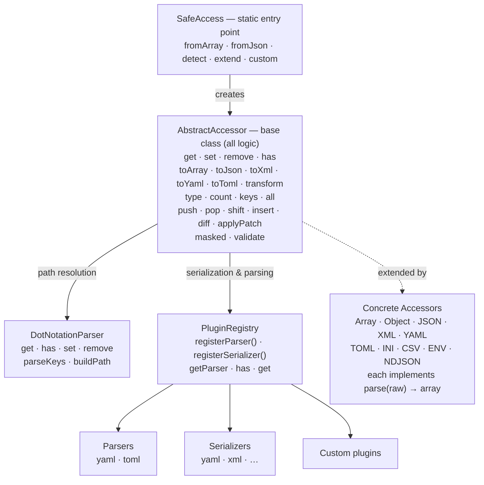
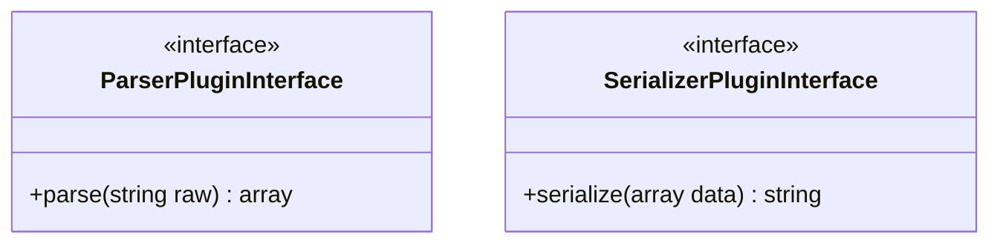
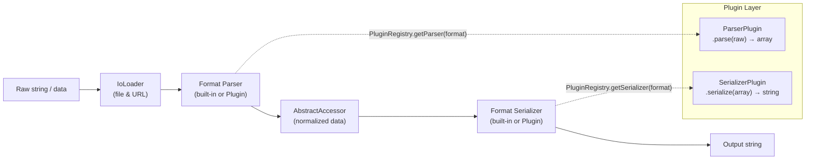
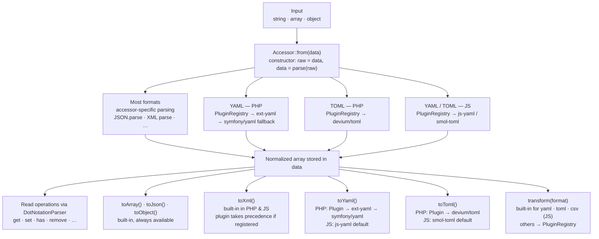
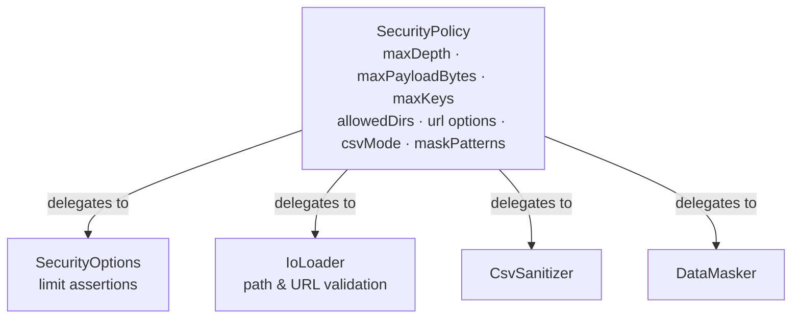
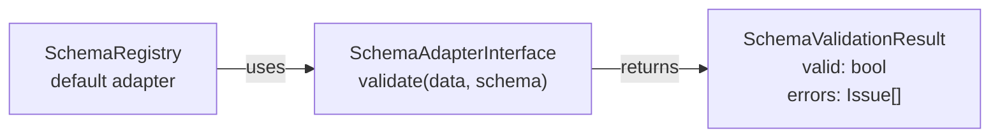

# Architecture

## Table of Contents

- [Architecture](#architecture)
    - [Table of Contents](#table-of-contents)
    - [Overview](#overview)
    - [Design Principles](#design-principles)
    - [Component Diagram](#component-diagram)
    - [Plugin System](#plugin-system)
        - [Contracts](#contracts)
        - [PluginRegistry](#pluginregistry)
        - [PHP vs JS Behavior](#php-vs-js-behavior)
        - [Plugin Layer Mapping](#plugin-layer-mapping)
            - [JavaScript / TypeScript](#javascript--typescript)
            - [PHP](#php)
            - [Extension Layer Diagram](#extension-layer-diagram)
            - [Plugin Lifecycle](#plugin-lifecycle)
            - [Adding a Custom Plugin](#adding-a-custom-plugin)
    - [Data Flow](#data-flow)
    - [DotNotationParser Engine](#dotnotationparser-engine)
    - [Immutability Pattern](#immutability-pattern)
    - [TypeDetector](#typedetector)
    - [Monorepo Structure](#monorepo-structure)
    - [Security Architecture](#security-architecture)
    - [I/O \& File Loading](#io--file-loading)
    - [Schema Validation](#schema-validation)
    - [Audit System](#audit-system)
    - [CLI Package](#cli-package)
    - [Framework Integrations](#framework-integrations)
    - [Architecture Decision Records](#architecture-decision-records)
        - [ADR-1: `set()` / `remove()` use `clone` instead of `static::from()`](#adr-1-set--remove-use-clone-instead-of-staticfrom)
        - [ADR-2: JS `toXml()` / `toYaml()` / `toToml()` via Real Libraries + Plugin Override](#adr-2-js-toxml--toyaml--totoml-via-real-libraries--plugin-override)
        - [ADR-3: Real Dependencies for YAML/TOML + PluginRegistry for Override](#adr-3-real-dependencies-for-yamltoml--pluginregistry-for-override)
    - [PHP ↔ JS Implementation Differences](#php--js-implementation-differences)
        - [Feature Parity Matrix](#feature-parity-matrix)
        - [`toArray()` vs `all()`](#toarray-vs-all)
        - [Composition Pattern: Traits (PHP) vs Static Delegation (JS)](#composition-pattern-traits-php-vs-static-delegation-js)
        - [Streaming: Sync (PHP) vs Async (JS)](#streaming-sync-php-vs-async-js)
        - [CompiledPath Internal Accessor Difference](#compiledpath-internal-accessor-difference)
        - [JSON Patch `test` Op: Absent Path Alignment](#json-patch-test-op-absent-path-alignment)
    - [Static State & Test Isolation (PHP)](#static-state--test-isolation-php)

## Overview

safe-access-inline is a format-agnostic data access library that provides a single API for safely reading, writing, and transforming deeply nested data structures. It follows the **Facade pattern** with a pluggable accessor system and an extensible **Plugin Registry** for format parsing and serialization.

## Design Principles

1. **Zero Surprises** — `get()` never throws exceptions. Missing paths return a default value.
2. **Format-Agnostic** — The same API works identically across all supported formats.
3. **Immutability** — `set()` and `remove()` always return new instances; the original is never mutated.
4. **Real Dependencies for Complex Formats** — YAML and TOML use real libraries (`js-yaml`/`smol-toml` in JS, `symfony/yaml`/`devium/toml` in PHP) as dependencies. The Plugin System provides optional override capability.
5. **Extensibility** — Custom accessors via `SafeAccess::extend()`, custom parsers and serializers via `PluginRegistry`.

## Component Diagram



## Plugin System

The Plugin System provides **optional override** capability for format-specific parsing and serialization. YAML and TOML use real libraries by default — plugins let users swap in alternative implementations.

### Contracts



- **`ParserPluginInterface`** — receives a raw string input (e.g., YAML text), returns a normalized associative array. Throws `InvalidFormatException` on malformed input.
- **`SerializerPluginInterface`** — receives a normalized array, returns a formatted string output (e.g., YAML text).

### PluginRegistry

A static registry that maps format names (e.g., `'yaml'`, `'toml'`) to parser and serializer implementations.

```
PluginRegistry::registerParser('yaml', new SymfonyYamlParser());
PluginRegistry::registerSerializer('yaml', new SymfonyYamlSerializer());

// Accessors query the registry:
// YamlAccessor::parse() → PluginRegistry::getParser('yaml')->parse($raw)
// $accessor->toYaml()   → PluginRegistry::getSerializer('yaml')->serialize($data)
// $accessor->transform('yaml') → same as toYaml()
```

### PHP vs JS Behavior

| Aspect                                                   | PHP                                                                                                                                  | JS/TS                                                                             |
| -------------------------------------------------------- | ------------------------------------------------------------------------------------------------------------------------------------ | --------------------------------------------------------------------------------- |
| YAML/TOML parsing                                        | Real library by default (`ext-yaml` or `symfony/yaml` for YAML, `devium/toml` for TOML); plugin **optional** (overrides)             | Real library by default (`js-yaml`, `smol-toml`); plugin **optional** (overrides) |
| Serialization (`toYaml`, `toToml`, `toXml`, `transform`) | Plugin override → `ext-yaml`/real library fallback (with `SimpleXMLElement` fallback for XML)                                        | Real library by default for YAML/TOML; plugin required for XML                    |
| Shipped plugins                                          | 6 plugins (SymfonyYamlParser, SymfonyYamlSerializer, NativeYamlParser, NativeYamlSerializer, DeviumTomlParser, DeviumTomlSerializer) | 4 plugins (JsYamlParser, JsYamlSerializer, SmolTomlParser, SmolTomlSerializer)    |

### Plugin Layer Mapping

Each plugin occupies a specific **layer** in the processing pipeline. The table below maps every shipped plugin to its layer, type, and registration key.

#### JavaScript / TypeScript

| Plugin               | Format Key | Type       | Layer         | Notes                                                     |
| -------------------- | ---------- | ---------- | ------------- | --------------------------------------------------------- |
| `JsYamlParser`       | `yaml`     | parser     | parsing       | Wraps `js-yaml`; **default** — registered automatically   |
| `JsYamlSerializer`   | `yaml`     | serializer | serialization | Wraps `js-yaml`; **default** — registered automatically   |
| `SmolTomlParser`     | `toml`     | parser     | parsing       | Wraps `smol-toml`; **default** — registered automatically |
| `SmolTomlSerializer` | `toml`     | serializer | serialization | Wraps `smol-toml`; **default** — registered automatically |

#### PHP

| Plugin                  | Format Key | Type       | Layer         | Notes                                            |
| ----------------------- | ---------- | ---------- | ------------- | ------------------------------------------------ |
| `SymfonyYamlParser`     | `yaml`     | parser     | parsing       | Wraps `symfony/yaml`; optional override          |
| `SymfonyYamlSerializer` | `yaml`     | serializer | serialization | Wraps `symfony/yaml`; optional override          |
| `NativeYamlParser`      | `yaml`     | parser     | parsing       | Wraps `ext-yaml`; optional override              |
| `NativeYamlSerializer`  | `yaml`     | serializer | serialization | Wraps `ext-yaml`; optional override              |
| `DeviumTomlParser`      | `toml`     | parser     | parsing       | Wraps `devium/toml`; **default** — auto-detected |
| `DeviumTomlSerializer`  | `toml`     | serializer | serialization | Wraps `devium/toml`; **default** — auto-detected |
| `SimpleXmlSerializer`   | `xml`      | serializer | serialization | Wraps `SimpleXMLElement`; fallback for `toXml()` |

#### Extension Layer Diagram



#### Plugin Lifecycle

1. **Registration** — `PluginRegistry.registerParser(format, plugin)` / `PluginRegistry.registerSerializer(format, plugin)`. Must happen before the first accessor of that format is created.

2. **Discovery** — When an accessor calls `parse()` or `toYaml()`, the registry is queried with the format key. If a plugin is registered it takes priority over the built-in default; otherwise the built-in library is used.

3. **Invocation** — The plugin's `parse()` or `serialize()` method is called synchronously. Plugins must throw `InvalidFormatException` on malformed input.

4. **Override precedence** — `registered plugin > real library default > built-in lightweight parser` (JS) / `registered plugin > ext-yaml / symfony/yaml` (PHP).

#### Adding a Custom Plugin

```typescript
// Implement one interface
import type { ParserPluginInterface } from "@safe-access-inline/safe-access-inline";

class MyYamlParser implements ParserPluginInterface {
    parse(raw: string): Record<string, unknown> {
        return myCustomYamlLib.parse(raw);
    }
}

// Register once at startup — overrides the default JsYamlParser
import { PluginRegistry } from "@safe-access-inline/safe-access-inline";
PluginRegistry.registerParser("yaml", new MyYamlParser());
```

See also: [Plugin Guide](/js/plugins)

## Data Flow



## DotNotationParser Engine

The parser resolves paths like `user.profile.name` against nested data structures.

**Supported path syntax:**

- `name` — simple key access
- `user.profile.name` — nested access
- `items.0.title` — numeric index access
- `matrix[0][1]` — bracket notation (converted to dot notation)
- `users.*.name` — wildcard (returns array of all matching values)
- `config\.db.host` — escaped dot (literal dot in key name)

**Resolution algorithm:**

1. Parse path into key segments via `parseKeys()`
2. Walk the data structure segment by segment
3. On `*` wildcard: iterate all children, recursively resolve remaining path
4. On escaped dot: treat as literal key name
5. Return default value if any segment is not found

## Immutability Pattern

```
$original = SafeAccess::fromJson('{"a": 1}');
$modified = $original->set('b', 2);

// $original->data = ['a' => 1]     ← unchanged
// $modified->data = ['a' => 1, 'b' => 2]  ← new instance
```

Implementation:

- PHP: `clone $this` + update `$data`
- JS: `clone(newData)` method creates a new instance with modified data (via `structuredClone`)

## TypeDetector

Auto-detection priority (first match wins):

1. **Array** → `ArrayAccessor`
2. **SimpleXMLElement** (PHP only) → `XmlAccessor`
3. **Object** → `ObjectAccessor`
4. **JSON string** (`{` or `[`) → `JsonAccessor`
5. **NDJSON string** (multiple `{...}` lines) → `NdjsonAccessor`
6. **XML string** (`<?xml` or `<`) → `XmlAccessor`
7. **YAML string** (contains `: ` without `=`) → `YamlAccessor`
8. **TOML string** (`key = "quoted"` pattern) → `TomlAccessor`
9. **INI string** (has `[section]` headers) → `IniAccessor`
10. **ENV string** (`KEY=VALUE` uppercase pattern) → `EnvAccessor`
11. **Unsupported** → throws `UnsupportedTypeError` / `UnsupportedTypeException`

> **Limitations:** CSV is not auto-detected. The YAML heuristic (`: ` without `=`) may produce false positives, and TOML detection (`key = "quoted"`) can occasionally conflict with some INI formats. Always prefer explicit factory methods (e.g., `fromYaml()`, `fromToml()`) for ambiguous inputs.

## Monorepo Structure

```
safe-access-inline/
├── packages/
│   ├── php/                 # Composer package
│   │   ├── src/
│   │   │   ├── Accessors/   # 10 format accessors (incl. NDJSON)
│   │   │   ├── Contracts/   # Interfaces (incl. ParserPlugin, SerializerPlugin, SchemaAdapter)
│   │   │   ├── Core/        # AbstractAccessor (root) + Parsers/, Resolvers/, Operations/, Rendering/, Io/, Registries/, Config/ subdirs
│   │   │   ├── Enums/       # Format, AuditEventType, PatchOperationType, SegmentType
│   │   │   ├── Exceptions/  # Exception hierarchy (incl. SecurityException, SchemaValidationException, ReadonlyViolationException)
│   │   │   ├── Integrations/# LaravelServiceProvider, SymfonyIntegration, SafeAccessBundle
│   │   │   ├── Plugins/     # Shipped plugins (SymfonyYaml*, NativeYaml*, DeviumToml*, SimpleXmlSerializer)
│   │   │   ├── SchemaAdapters/ # JsonSchemaAdapter, SymfonyValidatorAdapter
│   │   │   ├── Security/    # Guards/ (SecurityPolicy, SecurityOptions, SecurityGuard), Audit/ (AuditLogger), Sanitizers/ (CsvSanitizer, DataMasker)
│   │   │   ├── Traits/      # HasFactory, HasTransformations, HasWildcardSupport, HasArrayOperations
│   │   │   └── SafeAccess.php
│   │   └── tests/
│   │       ├── Unit/        # Mock-based unit tests
│   │       └── Integration/ # Real parser integration tests
│   ├── js/                  # npm package
│   │   ├── src/
│   │   │   ├── accessors/   # 10 format accessors (incl. NDJSON)
│   │   │   ├── contracts/   # TypeScript interfaces
│   │   │   ├── core/        # abstract-accessor.ts (root) + parsers/, resolvers/, operations/, rendering/, io/, registries/, config/ subdirs
│   │   │   ├── enums/       # Format, AuditEventType, PatchOperationType, SegmentType
│   │   │   ├── exceptions/  # Error hierarchy (incl. SecurityError, SchemaValidationError, ReadonlyViolationError)
│   │   │   ├── integrations/# NestJS module, Vite plugin
│   │   │   ├── plugins/     # Shipped plugins (JsYaml*, SmolToml*)
│   │   │   ├── schema-adapters/ # JsonSchemaAdapter, ZodAdapter, YupAdapter, ValibotAdapter
│   │   │   ├── security/    # guards/ (SecurityPolicy, SecurityOptions, SecurityGuard), audit/ (AuditEmitter), sanitizers/ (CsvSanitizer, DataMasker, IpRangeChecker)
│   │   │   ├── types/       # DeepPaths, ValueAtPath utility types
│   │   │   ├── safe-access.ts
│   │   │   └── index.ts     # Barrel export
│   │   └── tests/
│   │       ├── unit/        # Mock-based unit tests
│   │       └── integration/ # Cross-format pipeline tests
│   └── cli/                 # CLI package (@safe-access-inline/cli)
│       ├── src/            # cli.ts (dispatcher), command-handlers.ts (shared utils), handlers/ (12 individual command handlers)
│       └── tests/
├── docs/                    # Documentation (VitePress, English + pt-BR)
├── .github/workflows/       # CI/CD
├── CHANGELOG.md
├── CODE_OF_CONDUCT.md
├── CONTRIBUTING.md
├── LICENSE
├── SECURITY.md
└── README.md
```

## Security Architecture

The security module provides defense-in-depth for data processing:



- **SecurityPolicy** — Immutable aggregate of all security settings. Supports `merge()` for creating derived policies.
- **SecurityOptions** — Static assertion methods for payload size, key count, and nesting depth limits.
- **SecurityGuard** — Blocks prototype pollution keys (`__proto__`, `constructor`, `prototype`, `__defineGetter__`, `__defineSetter__`, `__lookupGetter__`, `__lookupSetter__`, `valueOf`, `toString`, `hasOwnProperty`, `isPrototypeOf`). Sanitizes objects recursively.
- **IoLoader** — Path-traversal protection for file reads. SSRF protection for URL fetches (blocks private IPs, cloud metadata, enforces HTTPS).
- **CsvSanitizer** — Guards against CSV injection attacks with configurable modes (none, prefix, strip, error).
- **DataMasker** — Replaces sensitive values (password, token, secret, etc.) with `[REDACTED]`. Supports custom glob/regex patterns.

## I/O & File Loading

File and URL loading follow a secure pipeline:

1. **Path validation** — Resolved path must be within `allowedDirs` (if specified)
2. **Format detection** — Extension-based (`resolveFormatFromExtension`)
3. **Content reading** — File system or HTTPS fetch
4. **Audit emission** — `file.read` or `url.fetch` event
5. **Accessor creation** — Delegated to the appropriate `SafeAccess.from*()` method

Cross-language runtime constraints matter here:

- **JS/TS** exposes both sync and async file-loading APIs (`fromFileSync()` and `fromFile()`), plus async URL loading.
- **PHP** exposes synchronous file and URL loading only.
- **JS/TS** file watching returns a single unsubscribe function and delegates to `fs.watch`.
- **PHP** file watching returns `{ poll, stop }` and uses explicit polling because there is no built-in event loop contract.

File watching in PHP therefore uses polling (`FileWatcher`) — checks mtime at configurable intervals and requires the caller to drive the blocking poll loop.

- **PathCache** — LRU in-memory cache layered between `AbstractAccessor` and `DotNotationParser`. Parsed path segment arrays are stored keyed by path string, eliminating redundant re-parsing on repeated hot-path accesses.

> **Cache interface divergence:** PHP's `remember()` / `forget()` accept `\Psr\SimpleCache\CacheInterface` (PSR-16). The JS equivalents accept a compact custom `CacheInterface` (`get / set / delete`) that is intentionally simpler than the PSR-16 contract — no `has()`, no `clear()`, and `get()` returns `unknown` instead of `mixed`. Implement the JS interface directly or wrap an existing PSR-16-compatible library.

Layered configuration (`layer()`, `layerFiles()`) deep-merges multiple sources with last-wins semantics.

## Schema Validation

Schema validation uses the **Adapter pattern** to remain library-agnostic:



Users implement `SchemaAdapterInterface` with their preferred validation library and register it via `SchemaRegistry.setDefaultAdapter()`.

The built-in shipped adapters are intentionally ecosystem-specific rather than strictly mirrored:

- **JS/TS:** `JsonSchemaAdapter`, `ZodSchemaAdapter`, `ValibotSchemaAdapter`, `YupSchemaAdapter`
- **PHP:** `JsonSchemaAdapter`, `SymfonyValidatorAdapter`

## Audit System

The audit system provides observability for security-relevant operations:

- **Event types:** `file.read`, `file.watch`, `url.fetch`, `security.violation`, `security.deprecation`, `data.mask`, `data.freeze`, `data.format_warning`, `schema.validate`
- **Subscription:** `SafeAccess.onAudit(listener)` returns an unsubscribe function
- **Emission:** Internal — triggered automatically by IoLoader, DataMasker, schema validation, etc.
- **Design:** Pub/sub pattern. Listeners are synchronous. Events include `type`, `timestamp`, and `detail` fields.

## CLI Package

The `@safe-access-inline/cli` package provides command-line access to all library features:

| Command     | Description                                  |
| ----------- | -------------------------------------------- |
| `get`       | Read a value by path                         |
| `set`       | Set a value at a path                        |
| `remove`    | Remove a value at a path                     |
| `transform` | Convert between formats (JSON ↔ YAML ↔ TOML) |
| `diff`      | Generate JSON Patch diff between two files   |
| `mask`      | Redact sensitive values                      |
| `layer`     | Merge multiple config files                  |
| `keys`      | List keys at a path                          |
| `type`      | Show the type of a value at a path           |
| `has`       | Check path existence (exit code 0/1)         |
| `count`     | Count elements at a path                     |

Supports stdin input (`-`), all formats (JSON, YAML, TOML, XML, INI, CSV, ENV, NDJSON), pretty output, and path expressions.

## Framework Integrations

| Framework | Package | Module                   | Features                                        |
| --------- | ------- | ------------------------ | ----------------------------------------------- |
| NestJS    | JS      | `SafeAccessModule`       | Dynamic module, `SAFE_ACCESS` injection token   |
| Vite      | JS      | `safeAccessPlugin`       | Virtual module, HMR support, multi-file merging |
| Laravel   | PHP     | `LaravelServiceProvider` | Singleton binding, config repository wrapping   |
| Symfony   | PHP     | `SymfonyIntegration`     | ParameterBag wrapping, YAML file loading        |

## Architecture Decision Records

### ADR-1: `set()` / `remove()` use `clone` instead of `static::from()`

**Context:** The PLAN.md specifies `set()` returns `static::from($newData)`. However, some accessors
carry metadata beyond the normalized array — for example, `XmlAccessor` stores the `originalXml` string.

**Decision:** Both PHP and JS use `clone` (PHP: `clone $this`; JS: `clone(newData)` method) to preserve
any accessor-specific metadata when producing a new instance. Only `$data` is updated.

**Consequence:** Metadata like `originalXml` survives mutations, which is the expected behavior. The
round-trip `set() → toXml()` can still access the original XML via `getOriginalXml()`.

> **Parameter divergence:** In PHP, `clone` is a language keyword — `clone $this` accepts no arguments. The accessor then directly mutates `$this->data` on the cloned instance. In JS, `clone(newData)` is a protected abstract method that each subclass implements, accepting the new data record as its sole argument. The PHP approach relies on post-clone mutation; the JS approach is purely constructor-based. The observable result is identical: a new instance with updated `data` and all other fields preserved.

### ADR-2: JS `toXml()` / `toYaml()` / `toToml()` via Real Libraries + Plugin Override

**Context:** Initially, the JS package omitted `toXml()` and `toYaml()` because JavaScript has no native XML emitter and YAML serialization would require a runtime dependency.

**Decision (original):** JS only exposed `toArray()`, `toJson()`, and `toObject()`.

**Decision (revised #1):** With the introduction of the Plugin System, JS exposed `toYaml()`, `toXml()`, and `transform()` via PluginRegistry.

**Decision (revised #2):** `js-yaml` and `smol-toml` are now real `dependencies`. `toYaml()` and `toToml()` work zero-config using these libraries. Plugins provide optional override for users who need different libraries. `toXml()` still requires a plugin.

**Consequence:** YAML and TOML serialization works out of the box. Users who need alternative serializers register a plugin override. XML serialization still requires explicit plugin registration.

### ADR-3: Real Dependencies for YAML/TOML + PluginRegistry for Override

**Context:** PHP's YAML and TOML accessors originally used `class_exists()` and `function_exists()` checks to detect available parsers at runtime. Later, a PluginRegistry was introduced that required manual plugin registration. Both PHP and JS had different approaches: PHP required plugins, JS had built-in lightweight parsers.

**Decision:** Make YAML/TOML libraries real dependencies in both platforms. `js-yaml` + `smol-toml` are `dependencies` in JS. `symfony/yaml` + `devium/toml` are `require` in PHP. PluginRegistry continues to exist for override: if a plugin is registered, it takes priority over the default library.

**Key design choices:**

- **Both platforms**: YAML/TOML parsing and serialization work out of the box — zero configuration needed.
- **Plugin override**: `PluginRegistry.registerParser()` / `PluginRegistry.registerSerializer()` still works — registered plugins take priority over default libraries.
- **JS built-in parsers removed**: The old lightweight YAML/TOML parsers were removed in favor of proven libraries (`js-yaml`, `smol-toml`).
- **Exception types**: `InvalidFormatException` at the accessor level, `UnsupportedTypeException` at the registry level.
- **Testing**: Unit tests use mock plugins (anonymous classes/objects) for isolation. Integration tests use real libraries.

**Consequence:** Zero configuration for YAML/TOML in both platforms. Consistent behavior between PHP and JS. Users who need alternative parsers/serializers register them via PluginRegistry.

---

## PHP ↔ JS Implementation Differences

The two implementations are semantically equivalent — the same dot-notation paths, the same operations, the same security guarantees — but idiomatic differences exist at the language level. This section documents them explicitly.

### Feature Parity Matrix

| Feature              | JavaScript / TypeScript                                                 | PHP                                                                                                                |
| -------------------- | ----------------------------------------------------------------------- | ------------------------------------------------------------------------------------------------------------------ |
| **Array operations** | Static class (`ArrayOperations`) delegated from the accessor            | Trait (`HasArrayOperations`) mixed into `AbstractAccessor`                                                         |
| **Type inference**   | `DeepPaths<T>` / `ValueAtPath<T, P>` generic parameters                 | `@template TShape` + custom PHPStan extension                                                                      |
| **Immutability**     | `Object.freeze()` + `deepFreeze()` at runtime                           | Private `$data` field + `$readonly` flag + `assertNotReadonly()`                                                   |
| **Constructor**      | `constructor(raw: unknown, options?: { readonly?: boolean })`           | `__construct(mixed $raw, bool $readonly = false)`                                                                  |
| **`toArray()`**      | Concrete alias of `all()` (not on interface)                            | Concrete alias of `all()` (not on interface)                                                                       |
| **I/O model**        | `fromFile()` async (Promise) + `fromFileSync()` sync; `fromUrl()` async | Synchronous only — all I/O completes before returning                                                              |
| **Async I/O**        | `fromFile()` async + `fromFileSync()` sync                              | Synchronous only                                                                                                   |
| **Streaming**        | `streamCsv()` / `streamNdjson()` — `AsyncGenerator` (`for await`)       | `streamCsv()` / `streamNdjson()` — `Generator` (`foreach`, synchronous)                                            |
| **File watcher**     | `fs.watch()` event-driven, non-blocking, debounced (100 ms)             | `filemtime()` polling (default 500 ms), **blocks the calling thread** — use Swoole/ReactPHP for non-blocking usage |
| **XML parsing**      | Delegates to plugin; no native parser                                   | `simplexml_load_string()` with XXE protection built-in                                                             |
| **Schema adapters**  | Zod, Valibot, Yup, JSON Schema                                          | JSON Schema, Symfony Validator                                                                                     |

### `toArray()` vs `all()`

Both implementations expose `all()` as the primary method returning a shallow copy of the internal data. `toArray()` is a concrete-class alias that follows PHP idioms (`ArrayAccess`, `Arrayable` conventions). It is not part of the published `ReadableInterface` / `AccessorInterface` contracts in either language:

```typescript
// JS — both are equivalent
accessor.all(); // Record<string, unknown>
accessor.toArray(); // Record<string, unknown>
```

```php
// PHP — both are equivalent
$accessor->all();     // array<mixed>
$accessor->toArray(); // array<mixed>
```

### Composition Pattern: Traits (PHP) vs Static Delegation (JS)

PHP uses trait composition to attach array operations and transformations to the abstract base:

```php
abstract class AbstractAccessor implements AccessorInterface, WritableInterface
{
    use HasArrayOperations;
    use HasTransformations;
    use HasTypeAccess;
    // ...
}
```

JS achieves the same result through static class delegation:

```typescript
// In AbstractAccessor
push(path: string, ...items: unknown[]): AbstractAccessor<T> {
    return this.mutate(ArrayOperations.push(this.data, path, ...items));
}
```

Both approaches produce identical consumer-facing APIs. The difference is an implementation detail with no behavioral impact.

### Streaming: Sync (PHP) vs Async (JS)

Both packages expose `streamCsv()` and `streamNdjson()` for memory-efficient, row-at-a-time processing of large files. The contracts are identical, but the runtime models differ:

| Aspect      | JavaScript / TypeScript                 | PHP                                   |
| ----------- | --------------------------------------- | ------------------------------------- |
| Return type | `AsyncGenerator<string[]>`              | `Generator` (synchronous, lazy)       |
| Iteration   | `for await (const row of stream) {}`    | `foreach ($stream as $row) {}`        |
| Blocking    | Non-blocking — yields to the event loop | Blocking — runs on the call stack     |
| Concurrency | Interleaves with other async tasks      | Single-threaded; I/O during iteration |

**Why the difference?** PHP's runtime is inherently synchronous — lazy `Generator` semantics are the idiomatic PHP solution and require no event loop. In Node.js, the `AsyncGenerator` pattern integrates naturally with `async/await` and avoids blocking the event loop during large file reads.

Both approaches deliver the same user-facing guarantee: rows are yielded one at a time without loading the entire file into memory. The choice of paradigm is a language-level constraint, not a feature difference.

### CompiledPath Internal Accessor Difference

`SafeAccess.compilePath(path)` pre-parses a dot-notation path and returns an opaque `CompiledPath` token that can be reused across multiple calls to avoid repeated parsing.

| Aspect         | JavaScript / TypeScript                                               | PHP                                                      |
| -------------- | --------------------------------------------------------------------- | -------------------------------------------------------- |
| Public surface | `CompiledPath` class — intentionally opaque, no public accessor       | `CompiledPath` class — `segments(): array` public method |
| Internal field | `_segments` (underscore-prefixed, signals "not part of the contract") | `$segments` (private, surfaced via `segments()`)         |

**In JS,** `_segments` is prefixed with `_` to signal it is framework-internal. Consumers should never read it directly; the `CompiledPath` token is only meaningful as an argument to `get()`, `set()`, `has()`, etc. If you need to inspect parsed segments for debugging, use `accessor.trace(path)` instead.

**In PHP,** `segments()` is public for compatibility with tooling that inspects path structure (e.g. custom validators). The design divergence is intentional and has no impact on normal usage.

### JSON Patch `test` Op: Absent Path Alignment

::: info Behaviour aligned in both runtimes
The JSON Patch `test` operation checks that the value at `path` equals `value`.
Both runtimes **throw** when the target path does not exist.

| Platform | Absent path  | `test` on absent path                     |
| -------- | ------------ | ----------------------------------------- |
| **PHP**  | path missing | **THROWS** `JsonPatchTestFailedException` |
| **JS**   | path missing | **THROWS** `JsonPatchTestFailedException` |

Note that a path explicitly set to `null` is considered _present_, so
`test` with `"value": null` on a `null`-valued path still _passes_.
:::

## Static State & Test Isolation (PHP)

The PHP `SafeAccess` façade uses **static state** in `PluginRegistry`,
`SchemaRegistry`, `PathCache`, and the global `SecurityPolicy`. This means
state registered in one test can leak into the next if not cleaned up.

### Resetting state between tests

Call `SafeAccess::reset()` (or the equivalent `SafeAccess::resetAll()`) in a
`beforeEach` or `afterEach` hook to guarantee a clean slate:

```php
beforeEach(fn () => SafeAccess::reset());
```

### Roadmap: `SafeAccessContext` (DI container)

> **Status: Planned**

A future `SafeAccessContext` class will mirror the JS `ServiceContainer`,
allowing per-instance registries instead of process-wide static state.
This enables parallel testing, multi-tenant applications, and proper
dependency injection without global side-effects.

Until `SafeAccessContext` ships, use `SafeAccess::reset()` as the
authoritative cleanup API.
