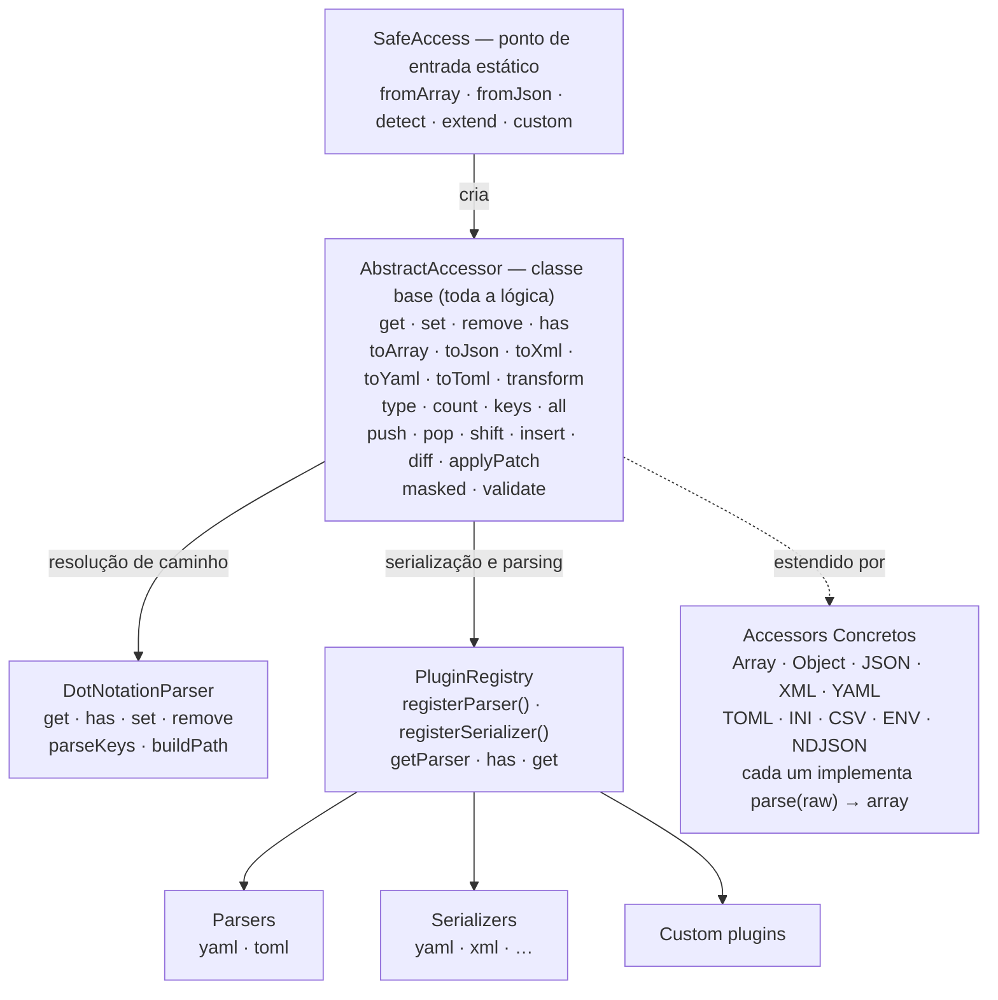
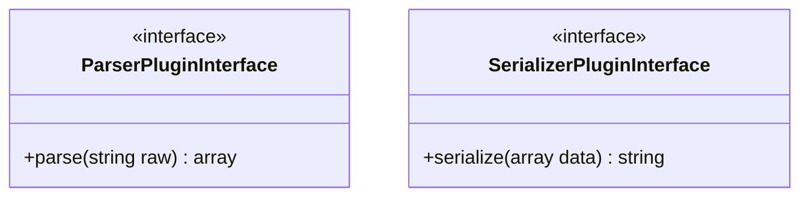
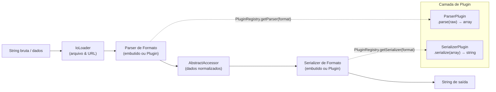
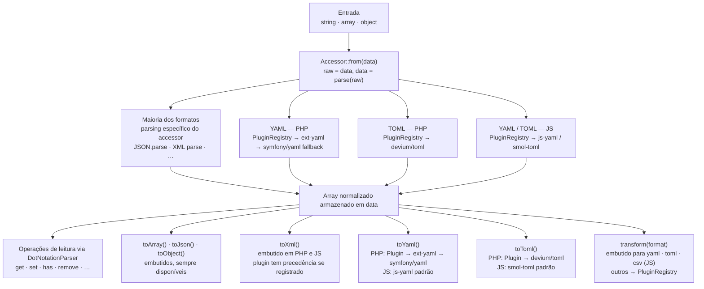
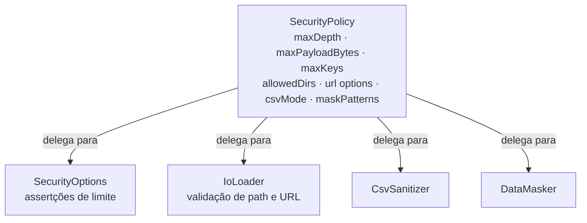
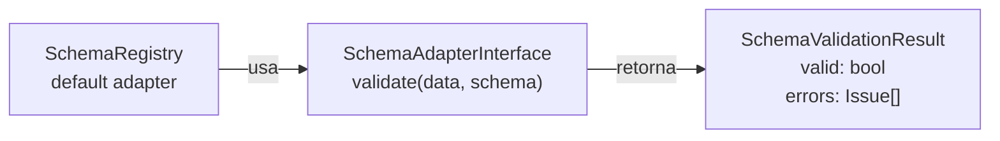

# Arquitetura

## Índice

- [Arquitetura](#arquitetura)
    - [Índice](#índice)
    - [Visão Geral](#visão-geral)
    - [Princípios de Design](#princípios-de-design)
    - [Diagrama de Componentes](#diagrama-de-componentes)
    - [Sistema de Plugins](#sistema-de-plugins)
        - [Contratos](#contratos)
        - [PluginRegistry](#pluginregistry)
        - [Comportamento PHP vs JS](#comportamento-php-vs-js)
        - [Mapeamento de Camadas de Plugin](#mapeamento-de-camadas-de-plugin)
            - [JavaScript / TypeScript](#javascript--typescript)
            - [PHP](#php)
            - [Diagrama de Camadas de Extensão](#diagrama-de-camadas-de-extensão)
            - [Ciclo de Vida do Plugin](#ciclo-de-vida-do-plugin)
            - [Adicionando um Plugin Customizado](#adicionando-um-plugin-customizado)
    - [Fluxo de Dados](#fluxo-de-dados)
    - [Motor DotNotationParser](#motor-dotnotationparser)
    - [Padrão de Imutabilidade](#padrão-de-imutabilidade)
    - [TypeDetector](#typedetector)
    - [Estrutura do Monorepo](#estrutura-do-monorepo)
    - [Arquitetura de Segurança](#arquitetura-de-segurança)
    - [I/O \& Carregamento de Arquivos](#io--carregamento-de-arquivos)
    - [Validação de Schema](#validação-de-schema)
    - [Sistema de Auditoria](#sistema-de-auditoria)
    - [Pacote CLI](#pacote-cli)
    - [Integrações com Frameworks](#integrações-com-frameworks)
    - [Registros de Decisão de Arquitetura](#registros-de-decisão-de-arquitetura)
        - [ADR-1: `set()` / `remove()` usam `clone` em vez de `static::from()`](#adr-1-set--remove-usam-clone-em-vez-de-staticfrom)
        - [ADR-2: JS `toXml()` / `toYaml()` / `toToml()` via Bibliotecas Reais + Plugin Override](#adr-2-js-toxml--toyaml--totoml-via-bibliotecas-reais--plugin-override)
        - [ADR-3: Dependências Reais para YAML/TOML + PluginRegistry para Override](#adr-3-dependências-reais-para-yamltoml--pluginregistry-para-override)
    - [Diferenças de Implementação PHP ↔ JS](#diferenças-de-implementação-php--js)
        - [Matriz de Paridade de Funcionalidades](#matriz-de-paridade-de-funcionalidades)
        - [`toArray()` vs `all()`](#toarray-vs-all)
        - [Padrão de Composição: Traits (PHP) vs Delegação Estática (JS)](#padrão-de-composição-traits-php-vs-delegação-estática-js)

## Visão Geral

safe-access-inline é uma biblioteca de acesso a dados agnóstica de formato que fornece uma única API para ler, escrever e transformar estruturas de dados profundamente aninhadas com segurança. Segue o padrão **Facade** com um sistema de accessors plugáveis e um **Plugin Registry** extensível para parsing e serialização de formatos.

## Princípios de Design

1. **Zero Surpresas** — `get()` nunca lança exceções. Caminhos não encontrados retornam um valor padrão.
2. **Agnóstico de Formato** — A mesma API funciona de forma idêntica em todos os formatos suportados.
3. **Imutabilidade** — `set()` e `remove()` sempre retornam novas instâncias; o original nunca é modificado.
4. **Dependências Reais para Formatos Complexos** — YAML e TOML usam bibliotecas reais (`js-yaml`/`smol-toml` em JS, `symfony/yaml`/`devium/toml` em PHP) como dependências. O Sistema de Plugins fornece capacidade opcional de override.
5. **Extensibilidade** — Accessors customizados via `SafeAccess::extend()`, parsers e serializers customizados via `PluginRegistry`.

## Diagrama de Componentes



## Sistema de Plugins

O Sistema de Plugins fornece capacidade de **override opcional** para parsing e serialização de formatos específicos. YAML e TOML usam bibliotecas reais por padrão — plugins permitem que usuários substituam por implementações alternativas.

### Contratos



- **`ParserPluginInterface`** — recebe uma string bruta (ex: texto YAML), retorna um array associativo normalizado. Lança `InvalidFormatException` para input malformado.
- **`SerializerPluginInterface`** — recebe um array normalizado, retorna uma string formatada (ex: texto YAML).

### PluginRegistry

Um registro estático que mapeia nomes de formato (ex: `'yaml'`, `'toml'`) para implementações de parser e serializer.

```
PluginRegistry::registerParser('yaml', new SymfonyYamlParser());
PluginRegistry::registerSerializer('yaml', new SymfonyYamlSerializer());

// Accessors consultam o registro:
// YamlAccessor::parse() → PluginRegistry::getParser('yaml')->parse($raw)
// $accessor->toYaml()   → PluginRegistry::getSerializer('yaml')->serialize($data)
// $accessor->transform('yaml') → mesmo que toYaml()
```

### Comportamento PHP vs JS

| Aspecto                                                 | PHP                                                                                                                                  | JS/TS                                                                                |
| ------------------------------------------------------- | ------------------------------------------------------------------------------------------------------------------------------------ | ------------------------------------------------------------------------------------ |
| Parsing YAML/TOML                                       | Biblioteca real por padrão (`ext-yaml` ou `symfony/yaml` para YAML, `devium/toml` para TOML); plugin **opcional** (overrides)        | Biblioteca real por padrão (`js-yaml`, `smol-toml`); plugin **opcional** (overrides) |
| Serialização (`toYaml`, `toToml`, `toXml`, `transform`) | Plugin override → fallback para `ext-yaml`/biblioteca real (com fallback `SimpleXMLElement` para XML)                                | Biblioteca real por padrão para YAML/TOML; plugin necessário para XML                |
| Plugins incluídos                                       | 6 plugins (SymfonyYamlParser, SymfonyYamlSerializer, NativeYamlParser, NativeYamlSerializer, DeviumTomlParser, DeviumTomlSerializer) | 4 plugins (JsYamlParser, JsYamlSerializer, SmolTomlParser, SmolTomlSerializer)       |

### Mapeamento de Camadas de Plugin

Cada plugin ocupa uma **camada** específica no pipeline de processamento. A tabela abaixo mapeia cada plugin incluído à sua camada, tipo e chave de registro.

#### JavaScript / TypeScript

| Plugin               | Chave de Formato | Tipo       | Camada        | Notas                                                        |
| -------------------- | ---------------- | ---------- | ------------- | ------------------------------------------------------------ |
| `JsYamlParser`       | `yaml`           | parser     | parsing       | Envolve `js-yaml`; **padrão** — registrado automaticamente   |
| `JsYamlSerializer`   | `yaml`           | serializer | serialization | Envolve `js-yaml`; **padrão** — registrado automaticamente   |
| `SmolTomlParser`     | `toml`           | parser     | parsing       | Envolve `smol-toml`; **padrão** — registrado automaticamente |
| `SmolTomlSerializer` | `toml`           | serializer | serialization | Envolve `smol-toml`; **padrão** — registrado automaticamente |

#### PHP

| Plugin                  | Chave de Formato | Tipo       | Camada        | Notas                                               |
| ----------------------- | ---------------- | ---------- | ------------- | --------------------------------------------------- |
| `SymfonyYamlParser`     | `yaml`           | parser     | parsing       | Envolve `symfony/yaml`; override opcional           |
| `SymfonyYamlSerializer` | `yaml`           | serializer | serialization | Envolve `symfony/yaml`; override opcional           |
| `NativeYamlParser`      | `yaml`           | parser     | parsing       | Envolve `ext-yaml`; override opcional               |
| `NativeYamlSerializer`  | `yaml`           | serializer | serialization | Envolve `ext-yaml`; override opcional               |
| `DeviumTomlParser`      | `toml`           | parser     | parsing       | Envolve `devium/toml`; **padrão** — auto-detectado  |
| `DeviumTomlSerializer`  | `toml`           | serializer | serialization | Envolve `devium/toml`; **padrão** — auto-detectado  |
| `SimpleXmlSerializer`   | `xml`            | serializer | serialization | Envolve `SimpleXMLElement`; fallback para `toXml()` |

#### Diagrama de Camadas de Extensão



#### Ciclo de Vida do Plugin

1. **Registro** — `PluginRegistry.registerParser(format, plugin)` / `PluginRegistry.registerSerializer(format, plugin)`. Deve ocorrer antes que o primeiro accessor daquele formato seja criado.

2. **Descoberta** — Quando um accessor chama `parse()` ou `toYaml()`, o registro é consultado com a chave de formato. Se um plugin estiver registrado, ele tem prioridade sobre o padrão embutido; caso contrário, a biblioteca embutida é usada.

3. **Invocação** — O método `parse()` ou `serialize()` do plugin é chamado sincronamente. Plugins devem lançar `InvalidFormatException` em input malformado.

4. **Precedência de override** — `plugin registrado > padrão da biblioteca real > parser leve embutido` (JS) / `plugin registrado > ext-yaml / symfony/yaml` (PHP).

#### Adicionando um Plugin Customizado

```typescript
// Implementar uma interface
import type { ParserPluginInterface } from "@safe-access-inline/safe-access-inline";

class MyYamlParser implements ParserPluginInterface {
    parse(raw: string): Record<string, unknown> {
        return myCustomYamlLib.parse(raw);
    }
}

// Registrar uma vez na inicialização — substitui o JsYamlParser padrão
import { PluginRegistry } from "@safe-access-inline/safe-access-inline";
PluginRegistry.registerParser("yaml", new MyYamlParser());
```

Veja também: [Guia de Plugins](/pt-br/js/plugins)

## Fluxo de Dados



## Motor DotNotationParser

O parser resolve caminhos como `user.profile.name` contra estruturas de dados aninhadas.

**Sintaxe de caminhos suportada:**

- `name` — acesso a chave simples
- `user.profile.name` — acesso aninhado
- `items.0.title` — acesso por índice numérico
- `matrix[0][1]` — notação de colchetes (convertida para notação de ponto)
- `users.*.name` — wildcard (retorna array de todos os valores correspondentes)
- `config\.db.host` — ponto escapado (ponto literal no nome da chave)

**Algoritmo de resolução:**

1. Analisa o caminho em segmentos de chave via `parseKeys()`
2. Percorre a estrutura de dados segmento por segmento
3. No wildcard `*`: itera todos os filhos, resolve recursivamente o caminho restante
4. No ponto escapado: trata como nome literal da chave
5. Retorna o valor padrão se qualquer segmento não for encontrado

## Padrão de Imutabilidade

```
$original = SafeAccess::fromJson('{"a": 1}');
$modified = $original->set('b', 2);

// $original->data = ['a' => 1]     ← inalterado
// $modified->data = ['a' => 1, 'b' => 2]  ← nova instância
```

Implementação:

- PHP: `clone $this` + atualiza `$data`
- JS: método `clone(newData)` cria nova instância com dados modificados (via `structuredClone`)

## TypeDetector

Prioridade de auto-detecção (primeiro match vence):

1. **Array** → `ArrayAccessor`
2. **SimpleXMLElement** (apenas PHP) → `XmlAccessor`
3. **Object** → `ObjectAccessor`
4. **String JSON** (`{` ou `[`) → `JsonAccessor`
5. **String NDJSON** (múltiplas linhas `{...}`) → `NdjsonAccessor`
6. **String XML** (`<?xml` ou `<`) → `XmlAccessor`
7. **String YAML** (contém `: ` sem `=`) → `YamlAccessor`
8. **String TOML** (padrão `chave = "quoted"`) → `TomlAccessor`
9. **String INI** (tem cabeçalhos `[seção]`) → `IniAccessor`
10. **String ENV** (padrão `CHAVE=VALOR` maiúsculo) → `EnvAccessor`
11. **Não suportado** → lança `UnsupportedTypeError` / `UnsupportedTypeException`

> **Limitações:** CSV não é auto-detectado. A heurística YAML (`: ` sem `=`) pode produzir falsos positivos, e a detecção TOML (`chave = "quoted"`) pode ocasionalmente conflitar com alguns formatos INI. Sempre prefira métodos factory explícitos (ex: `fromYaml()`, `fromToml()`) para inputs ambíguos.

## Estrutura do Monorepo

```
safe-access-inline/
├── packages/
│   ├── php/                 # Pacote Composer
│   │   ├── src/
│   │   │   ├── Accessors/   # 10 accessors de formato (incl. NDJSON)
│   │   │   ├── Contracts/   # Interfaces (incl. ParserPlugin, SerializerPlugin, SchemaAdapter)
│   │   │   ├── Core/        # AbstractAccessor (root) + Parsers/, Resolvers/, Operations/, Rendering/, Io/, Registries/, Config/ subdirs
│   │   │   ├── Enums/       # Format, AuditEventType, PatchOperationType, SegmentType
│   │   │   ├── Exceptions/  # Hierarquia de exceções (incl. SecurityException, SchemaValidationException, ReadonlyViolationException)
│   │   │   ├── Integrations/# LaravelServiceProvider, SymfonyIntegration, SafeAccessBundle
│   │   │   ├── Plugins/     # Plugins incluídos (SymfonyYaml*, NativeYaml*, DeviumToml*, SimpleXmlSerializer)
│   │   │   ├── SchemaAdapters/ # JsonSchemaAdapter, SymfonyValidatorAdapter
│   │   │   ├── Security/    # Guards/ (SecurityPolicy, SecurityOptions, SecurityGuard), Audit/ (AuditLogger), Sanitizers/ (CsvSanitizer, DataMasker)
│   │   │   ├── Traits/      # HasFactory, HasTransformations, HasWildcardSupport, HasArrayOperations
│   │   │   └── SafeAccess.php
│   │   └── tests/
│   │       ├── Unit/        # Testes unitários mock-based
│   │       └── Integration/ # Testes de integração com parsers reais
│   ├── js/                  # Pacote npm
│   │   ├── src/
│   │   │   ├── accessors/   # 10 accessors de formato (incl. NDJSON)
│   │   │   ├── contracts/   # Interfaces TypeScript
│   │   │   ├── core/        # abstract-accessor.ts (root) + parsers/, resolvers/, operations/, rendering/, io/, registries/, config/ subdirs
│   │   │   ├── enums/       # Format, AuditEventType, PatchOperationType, SegmentType
│   │   │   ├── exceptions/  # Hierarquia de erros (incl. SecurityError, SchemaValidationError, ReadonlyViolationError)
│   │   │   ├── integrations/# Módulo NestJS, plugin Vite
│   │   │   ├── plugins/     # Plugins incluídos (JsYaml*, SmolToml*)
│   │   │   ├── schema-adapters/ # JsonSchemaAdapter, ZodAdapter, YupAdapter, ValibotAdapter
│   │   │   ├── security/    # guards/ (SecurityPolicy, SecurityOptions, SecurityGuard), audit/ (AuditEmitter), sanitizers/ (CsvSanitizer, DataMasker, IpRangeChecker)
│   │   │   ├── types/       # DeepPaths, ValueAtPath utility types
│   │   │   ├── safe-access.ts
│   │   │   └── index.ts     # Barrel export
│   │   └── tests/
│   │       ├── unit/        # Testes unitários mock-based
│   │       └── integration/ # Testes de pipeline cross-format
│   └── cli/                 # Pacote CLI (@safe-access-inline/cli)
│       ├── src/cli.ts       # Ponto de entrada CLI (get, set, remove, transform, convert, diff, mask, layer, keys, type, has, count, validate)
│       └── tests/
├── docs/                    # Documentação (VitePress, English + pt-BR)
├── .github/workflows/       # CI/CD
├── CHANGELOG.md
├── CODE_OF_CONDUCT.md
├── CONTRIBUTING.md
├── LICENSE
├── SECURITY.md
└── README.md
```

## Arquitetura de Segurança

O módulo de segurança fornece defesa em profundidade para processamento de dados:



- **SecurityPolicy** — Agregado imutável de todas as configurações de segurança. Suporta `merge()` para criar políticas derivadas.
- **SecurityOptions** — Métodos estáticos de asserção para limites de tamanho de payload, contagem de chaves e profundidade de aninhamento.
- **SecurityGuard** — Bloqueia chaves de prototype pollution (`__proto__`, `constructor`, `prototype`, `__defineGetter__`, `__defineSetter__`, `__lookupGetter__`, `__lookupSetter__`, `valueOf`, `toString`, `hasOwnProperty`, `isPrototypeOf`). Sanitiza objetos recursivamente.
- **IoLoader** — Proteção contra path-traversal para leitura de arquivos. Proteção contra SSRF para fetch de URLs (bloqueia IPs privados, metadata de cloud, exige HTTPS).
- **CsvSanitizer** — Protege contra ataques de CSV injection com modos configuráveis (none, prefix, strip, error).
- **DataMasker** — Substitui valores sensíveis (password, token, secret, etc.) por `[REDACTED]`. Suporta padrões customizados de glob/regex.

## I/O & Carregamento de Arquivos

Carregamento de arquivos e URLs segue um pipeline seguro:

1. **Validação de caminho** — O caminho resolvido deve estar dentro de `allowedDirs` (se especificado)
2. **Detecção de formato** — Baseada em extensão (`resolveFormatFromExtension`)
3. **Leitura de conteúdo** — Sistema de arquivos ou fetch HTTPS
4. **Emissão de auditoria** — Evento `file.read` ou `url.fetch`
5. **Criação do accessor** — Delegado ao método `SafeAccess.from*()` apropriado

As restrições do runtime de cada linguagem importam aqui:

- **JS/TS** expõe APIs de carregamento de arquivo síncronas e assíncronas (`fromFileSync()` e `fromFile()`), além de carregamento assíncrono de URL.
- **PHP** expõe apenas carregamento síncrono de arquivos e URLs.
- **JS/TS** retorna uma única função de unsubscribe em file watching e delega para `fs.watch`.
- **PHP** retorna `{ poll, stop }` em file watching e usa polling explícito porque não há um contrato de event loop embutido.

Por isso, o file watching em PHP usa polling (`FileWatcher`) — verifica `mtime` em intervalos configuráveis e exige que o chamador dirija explicitamente o loop bloqueante.

- **PathCache** — Cache LRU em memória entre `AbstractAccessor` e `DotNotationParser`. Arrays de segmentos de caminhos parseados são armazenados indexados pela string do caminho, eliminando re-parsing redundante em acessos frequentes.

Configuração em camadas (`layer()`, `layerFiles()`) realiza deep-merge de múltiplas fontes com semântica last-wins.

## Validação de Schema

A validação de schema usa o padrão **Adapter** para permanecer agnóstica de biblioteca:



Usuários implementam `SchemaAdapterInterface` com sua biblioteca de validação preferida e registram via `SchemaRegistry.setDefaultAdapter()`.

Os adapters incluídos no pacote são intencionalmente específicos de ecossistema, e não espelhados rigidamente entre linguagens:

- **JS/TS:** `JsonSchemaAdapter`, `ZodSchemaAdapter`, `ValibotSchemaAdapter`, `YupSchemaAdapter`
- **PHP:** `JsonSchemaAdapter`, `SymfonyValidatorAdapter`

## Sistema de Auditoria

O sistema de auditoria fornece observabilidade para operações relevantes à segurança:

- **Tipos de evento:** `file.read`, `file.watch`, `url.fetch`, `security.violation`, `security.deprecation`, `data.mask`, `data.freeze`, `data.format_warning`, `schema.validate`
- **Assinatura:** `SafeAccess.onAudit(listener)` retorna uma função de unsubscribe
- **Emissão:** Interna — disparada automaticamente por IoLoader, DataMasker, validação de schema, etc.
- **Design:** Padrão pub/sub. Listeners são síncronos. Eventos incluem campos `type`, `timestamp` e `detail`.

## Pacote CLI

O pacote `@safe-access-inline/cli` fornece acesso via linha de comando a todas as funcionalidades da biblioteca:

| Comando     | Descrição                                       |
| ----------- | ----------------------------------------------- |
| `get`       | Ler um valor por caminho                        |
| `set`       | Definir um valor em um caminho                  |
| `remove`    | Remover um valor em um caminho                  |
| `transform` | Converter entre formatos (JSON ↔ YAML ↔ TOML)   |
| `diff`      | Gerar diff JSON Patch entre dois arquivos       |
| `mask`      | Ocultar valores sensíveis                       |
| `layer`     | Mesclar múltiplos arquivos de configuração      |
| `keys`      | Listar chaves em um caminho                     |
| `type`      | Mostrar o tipo de um valor em um caminho        |
| `has`       | Verificar existência de caminho (exit code 0/1) |
| `count`     | Contar elementos em um caminho                  |

Suporta entrada via stdin (`-`), todos os formatos (JSON, YAML, TOML, XML, INI, CSV, ENV, NDJSON), saída formatada e expressões de caminho.

## Integrações com Frameworks

| Framework | Pacote | Módulo                   | Funcionalidades                                          |
| --------- | ------ | ------------------------ | -------------------------------------------------------- |
| NestJS    | JS     | `SafeAccessModule`       | Módulo dinâmico, token de injeção `SAFE_ACCESS`          |
| Vite      | JS     | `safeAccessPlugin`       | Módulo virtual, suporte HMR, merge de múltiplos arquivos |
| Laravel   | PHP    | `LaravelServiceProvider` | Binding singleton, wrapping do config repository         |
| Symfony   | PHP    | `SymfonyIntegration`     | Wrapping de ParameterBag, carregamento de arquivo YAML   |

## Registros de Decisão de Arquitetura

### ADR-1: `set()` / `remove()` usam `clone` em vez de `static::from()`

**Contexto:** O PLAN.md especifica `set()` retorna `static::from($newData)`. No entanto, alguns accessors carregam metadata além do array normalizado — por exemplo, `XmlAccessor` armazena a string `originalXml`.

**Decisão:** Tanto PHP quanto JS usam `clone` (PHP: `clone $this`; JS: método `clone(newData)`) para preservar qualquer metadata específica do accessor ao produzir uma nova instância. Apenas `$data` é atualizado.

**Consequência:** Metadata como `originalXml` sobrevive a mutações, que é o comportamento esperado. O round-trip `set() → toXml()` ainda pode acessar o XML original via `getOriginalXml()`.

### ADR-2: JS `toXml()` / `toYaml()` / `toToml()` via Bibliotecas Reais + Plugin Override

**Contexto:** Inicialmente, o pacote JS omitia `toXml()` e `toYaml()` porque JavaScript não tem emissor XML nativo e serialização YAML exigiria uma dependência de runtime.

**Decisão (original):** JS expunha apenas `toArray()`, `toJson()` e `toObject()`.

**Decisão (revisão #1):** Com a introdução do Sistema de Plugins, JS expôs `toYaml()`, `toXml()` e `transform()` via PluginRegistry.

**Decisão (revisão #2):** `js-yaml` e `smol-toml` agora são `dependencies` reais. `toYaml()` e `toToml()` funcionam sem configuração usando essas bibliotecas. Plugins fornecem override opcional para usuários que precisam de bibliotecas diferentes. `toXml()` ainda requer plugin.

**Consequência:** Serialização YAML e TOML funciona sem configuração. Usuários que precisam de serializers alternativos registram um plugin override. Serialização XML ainda requer registro explícito de plugin.

### ADR-3: Dependências Reais para YAML/TOML + PluginRegistry para Override

**Contexto:** Os accessors YAML e TOML do PHP originalmente usavam checks `class_exists()` e `function_exists()` para detectar parsers disponíveis em runtime. Depois, um PluginRegistry foi introduzido que exigia registro manual de plugins. PHP e JS tinham abordagens diferentes: PHP exigia plugins, JS tinha parsers leves embutidos.

**Decisão:** Tornar bibliotecas YAML/TOML dependências reais em ambas plataformas. `js-yaml` + `smol-toml` são `dependencies` em JS. `symfony/yaml` + `devium/toml` são `require` em PHP. PluginRegistry continua existindo para override: se um plugin é registrado, ele tem prioridade sobre a biblioteca padrão.

**Escolhas-chave de design:**

- **Ambas plataformas**: Parsing e serialização YAML/TOML funcionam sem configuração — zero configuração necessária.
- **Plugin override**: `PluginRegistry.registerParser()` / `PluginRegistry.registerSerializer()` ainda funciona — plugins registrados têm prioridade sobre bibliotecas padrão.
- **Parsers embutidos JS removidos**: Os antigos parsers leves YAML/TOML foram removidos em favor de bibliotecas comprovadas (`js-yaml`, `smol-toml`).
- **Tipos de exceção**: `InvalidFormatException` no nível do accessor, `UnsupportedTypeException` no nível do registro.
- **Testes**: Testes unitários usam plugins mock (classes/objetos anônimos) para isolamento. Testes de integração usam bibliotecas reais.

**Consequência:** Zero configuração para YAML/TOML em ambas plataformas. Comportamento consistente entre PHP e JS. Usuários que precisam de parsers/serializers alternativos os registram via PluginRegistry.

## Diferenças de Implementação PHP ↔ JS

As duas implementações são semanticamente equivalentes — os mesmos caminhos dot-notation, as mesmas operações, as mesmas garantias de segurança — mas diferenças idiomáticas existem no nível da linguagem. Esta seção as documenta explicitamente.

### Matriz de Paridade de Funcionalidades

| Funcionalidade          | JavaScript / TypeScript                                       | PHP                                                                 |
| ----------------------- | ------------------------------------------------------------- | ------------------------------------------------------------------- |
| **Operações de array**  | Classe estática (`ArrayOperations`) delegada pelo accessor    | Trait (`HasArrayOperations`) mixado em `AbstractAccessor`           |
| **Inferência de tipos** | Parâmetros genéricos `DeepPaths<T>` / `ValueAtPath<T, P>`     | `@template TShape` + extensão PHPStan customizada                   |
| **Imutabilidade**       | `Object.freeze()` + `deepFreeze()` em runtime                 | Campo privado `$data` + flag `$readonly` + `assertNotReadonly()`    |
| **Constructor**         | `constructor(raw: unknown, options?: { readonly?: boolean })` | `__construct(mixed $raw, bool $readonly = false)`                   |
| **`toArray()`**         | Alias concreto de `all()` (não na interface)                  | Alias concreto de `all()` (não na interface)                        |
| **I/O Assíncrono**      | `fromFile()` async + `fromFileSync()` sync                    | Apenas síncrono                                                     |
| **File watcher**        | Retorna uma única função `stop()`                             | Retorna `{ poll, stop }` — polling deve ser dirigido explicitamente |
| **Parsing XML**         | Delega para plugin; sem parser nativo                         | `simplexml_load_string()` com proteção XXE embutida                 |
| **Adapters de schema**  | Zod, Valibot, Yup, JSON Schema                                | JSON Schema, Symfony Validator                                      |

### `toArray()` vs `all()`

Ambas implementações expõem `all()` como método primário retornando uma cópia rasa dos dados internos. `toArray()` é um alias de classe concreta que segue idiomas PHP (convenções `ArrayAccess`, `Arrayable`). Não faz parte dos contratos publicados `ReadableInterface` / `AccessorInterface` em nenhuma linguagem:

```typescript
// JS — ambos são equivalentes
accessor.all(); // Record<string, unknown>
accessor.toArray(); // Record<string, unknown>
```

```php
// PHP — ambos são equivalentes
$accessor->all();     // array<mixed>
$accessor->toArray(); // array<mixed>
```

### Padrão de Composição: Traits (PHP) vs Delegação Estática (JS)

PHP usa composição de traits para anexar operações de array e transformações à base abstrata:

```php
abstract class AbstractAccessor implements AccessorInterface, WritableInterface
{
    use HasArrayOperations;
    use HasTransformations;
    use HasTypeAccess;
    // ...
}
```

JS alcança o mesmo resultado através de delegação para classe estática:

```typescript
// Em AbstractAccessor
push(path: string, ...items: unknown[]): AbstractAccessor<T> {
    return this.mutate(ArrayOperations.push(this.data, path, ...items));
}
```

Ambas abordagens produzem APIs idênticas para o consumidor. A diferença é um detalhe de implementação sem impacto comportamental.
